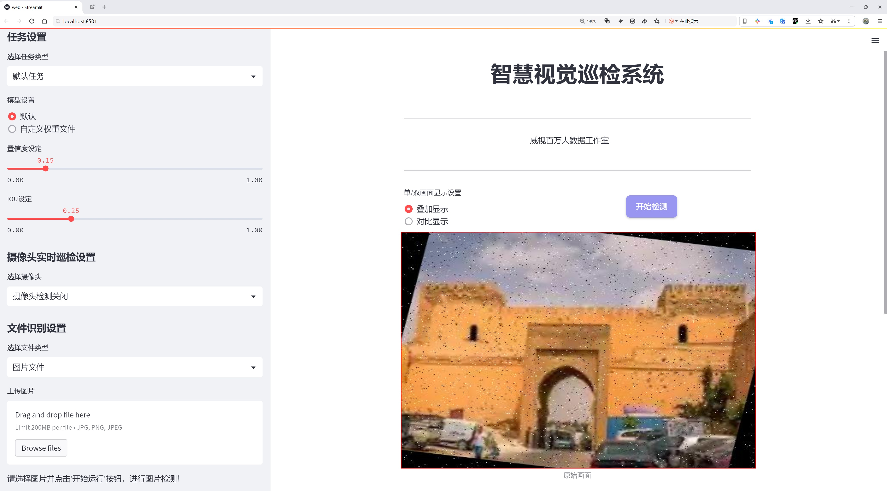
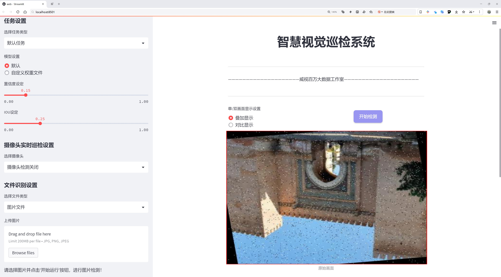
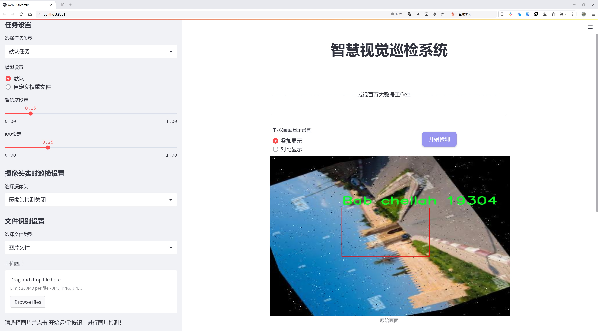
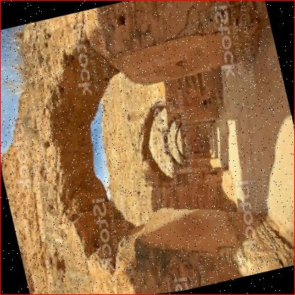
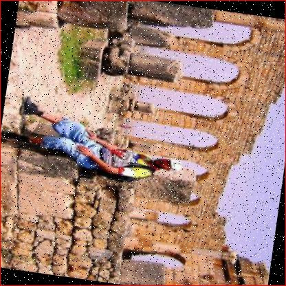
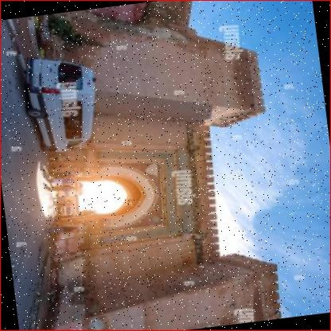
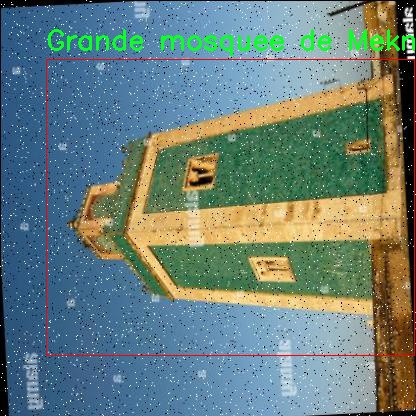
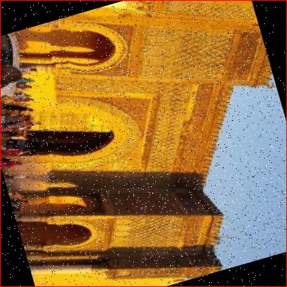

# 建筑物检测与识别检测系统源码分享
 # [一条龙教学YOLOV8标注好的数据集一键训练_70+全套改进创新点发刊_Web前端展示]

### 1.研究背景与意义

项目参考[AAAI Association for the Advancement of Artificial Intelligence](https://gitee.com/qunshansj/projects)

项目来源[AACV Association for the Advancement of Computer Vision](https://gitee.com/qunmasj/projects)

研究背景与意义

随着城市化进程的加速，建筑物的数量和种类日益增加，建筑物的检测与识别在城市管理、文化遗产保护以及智能城市建设中显得尤为重要。传统的建筑物检测方法往往依赖于人工巡查和简单的图像处理技术，效率低下且容易受到人为因素的影响。近年来，深度学习技术的迅猛发展为建筑物检测与识别提供了新的解决方案，其中，YOLO（You Only Look Once）系列模型因其高效的实时检测能力而备受关注。YOLOv8作为该系列的最新版本，具有更强的特征提取能力和更快的推理速度，成为建筑物检测与识别系统的理想选择。

本研究旨在基于改进的YOLOv8模型，构建一个高效的建筑物检测与识别系统，尤其聚焦于摩洛哥的建筑物。摩洛哥作为一个拥有丰富历史和文化遗产的国家，其建筑物种类繁多，包括历史遗址、宗教建筑和现代建筑等。通过对摩洛哥特有建筑物的检测与识别，不仅可以为城市规划和管理提供数据支持，还可以为文化遗产的保护与传承提供科学依据。

本研究所使用的数据集“Morocco lens”包含3900幅图像，涵盖20个不同类别的建筑物，如“Bab El-khamis”、“Grande mosquee de Meknes”、“Koutoubia”等。这些建筑物不仅在摩洛哥的城市景观中占据重要地位，同时也承载着丰富的历史文化内涵。通过对这些建筑物的检测与识别，可以深入分析摩洛哥的建筑风格、历史演变及其在城市发展中的作用，为相关领域的研究提供宝贵的数据支持。

此外，改进YOLOv8模型的应用能够显著提高建筑物检测的准确性和效率。通过引入更先进的特征提取网络和优化的损失函数，本研究将针对建筑物的复杂形态和多样性进行定制化改进，从而提升模型在实际应用中的表现。这不仅为建筑物检测技术的发展提供了新的思路，也为相关研究提供了可借鉴的经验。

综上所述，本研究的意义在于通过基于改进YOLOv8的建筑物检测与识别系统，为摩洛哥的城市管理和文化遗产保护提供有效的技术支持。同时，研究成果将为深度学习在建筑物检测领域的应用提供新的视角，推动相关技术的进一步发展。通过将先进的计算机视觉技术与丰富的文化遗产相结合，本研究不仅有助于提升建筑物检测的智能化水平，也为保护和传承摩洛哥独特的历史文化提供了重要的技术保障。

### 2.图片演示







##### 注意：由于此博客编辑较早，上面“2.图片演示”和“3.视频演示”展示的系统图片或者视频可能为老版本，新版本在老版本的基础上升级如下：（实际效果以升级的新版本为准）

  （1）适配了YOLOV8的“目标检测”模型和“实例分割”模型，通过加载相应的权重（.pt）文件即可自适应加载模型。

  （2）支持“图片识别”、“视频识别”、“摄像头实时识别”三种识别模式。

  （3）支持“图片识别”、“视频识别”、“摄像头实时识别”三种识别结果保存导出，解决手动导出（容易卡顿出现爆内存）存在的问题，识别完自动保存结果并导出到tempDir中。

  （4）支持Web前端系统中的标题、背景图等自定义修改，后面提供修改教程。

  另外本项目提供训练的数据集和训练教程,暂不提供权重文件（best.pt）,需要您按照教程进行训练后实现图片演示和Web前端界面演示的效果。

### 3.视频演示

[3.1 视频演示](https://www.bilibili.com/video/BV18GtoeuEj8/)

### 4.数据集信息展示

##### 4.1 本项目数据集详细数据（类别数＆类别名）

nc: 19
names: ['Bab El-khamis', 'Bab Mansour', 'Bab berdaine', 'Bab chellah', 'Grande mosquee de Meknes', 'Heri es souani', 'Koutoubia', 'Medersa Attarine', 'Menara', 'Mosque hassa 2', 'Musee Mohammed VI', 'Musee Nejjarin', 'Oualili', 'Palais El Badi', 'Palais Royal de Fes', 'Porte Bab Boujloud', 'Tannerie Chouara', 'Tombeaux saadiens', 'Tour hassan']


##### 4.2 本项目数据集信息介绍

数据集信息展示

在建筑物检测与识别领域，数据集的质量和多样性直接影响到模型的训练效果和应用性能。本研究采用的“Morocco lens”数据集，专门针对摩洛哥的历史建筑和文化遗址进行了精心的构建，旨在提升YOLOv8模型在建筑物检测与识别任务中的表现。该数据集包含19个类别，涵盖了摩洛哥丰富的建筑遗产，体现了该地区独特的历史和文化背景。

数据集中包含的类别包括：Bab El-khamis、Bab Mansour、Bab berdaine、Bab chellah、Grande mosquee de Meknes、Heri es souani、Koutoubia、Medersa Attarine、Menara、Mosque hassa 2、Musee Mohammed VI、Musee Nejjarin、Oualili、Palais El Badi、Palais Royal de Fes、Porte Bab Boujloud、Tannerie Chouara、Tombeaux saadiens以及Tour hassan。这些类别不仅代表了摩洛哥的建筑风格和历史遗迹，还展示了该国在建筑艺术方面的多样性与复杂性。

每个类别都经过精细标注，确保数据集在训练过程中能够提供高质量的样本。这些样本包括不同角度、不同光照条件下的建筑物图像，旨在提高模型的鲁棒性和准确性。例如，Koutoubia清真寺作为摩洛哥最著名的地标之一，其图像在数据集中占据重要位置，模型在识别此类建筑时能够更好地捕捉其独特的建筑特征和细节。

此外，数据集的构建考虑到了多样性和代表性，确保每个类别的样本数量均衡，从而避免模型在训练过程中对某些类别的偏见。这种平衡的样本分布使得模型在面对实际应用时，能够更好地适应不同类型建筑物的检测需求。通过对“Morocco lens”数据集的训练，YOLOv8模型将能够在摩洛哥的建筑物检测任务中实现更高的准确率和更快的响应速度。

在数据集的使用过程中，研究者还将探索不同的图像增强技术，以进一步提升模型的性能。这些技术包括图像旋转、缩放、裁剪和颜色调整等，旨在模拟现实世界中可能遇到的各种情况，从而增强模型的泛化能力。

总之，“Morocco lens”数据集不仅为建筑物检测与识别提供了丰富的样本资源，也为研究者在该领域的探索提供了坚实的基础。通过对该数据集的深入分析和应用，期望能够推动建筑物检测技术的发展，助力智能城市建设和文化遗产保护的相关研究。随着YOLOv8模型的不断优化和改进，未来在建筑物检测与识别领域的应用前景将更加广阔。











### 5.全套项目环境部署视频教程（零基础手把手教学）

[5.1 环境部署教程链接（零基础手把手教学）](https://www.ixigua.com/7404473917358506534?logTag=c807d0cbc21c0ef59de5)


[5.2 安装Python虚拟环境创建和依赖库安装视频教程链接（零基础手把手教学）](https://www.ixigua.com/7404474678003106304?logTag=1f1041108cd1f708b01a)

### 6.手把手YOLOV8训练视频教程（零基础小白有手就能学会）

[6.1 手把手YOLOV8训练视频教程（零基础小白有手就能学会）](https://www.ixigua.com/7404477157818401292?logTag=d31a2dfd1983c9668658)

### 7.70+种全套YOLOV8创新点代码加载调参视频教程（一键加载写好的改进模型的配置文件）

[7.1 70+种全套YOLOV8创新点代码加载调参视频教程（一键加载写好的改进模型的配置文件）](https://www.ixigua.com/7404478314661806627?logTag=29066f8288e3f4eea3a4)

### 8.70+种全套YOLOV8创新点原理讲解（非科班也可以轻松写刊发刊，V10版本正在科研待更新）

由于篇幅限制，每个创新点的具体原理讲解就不一一展开，具体见下列网址中的创新点对应子项目的技术原理博客网址【Blog】：


[8.1 70+种全套YOLOV8创新点原理讲解链接](https://gitee.com/qunmasj/good)

### 9.系统功能展示（检测对象为举例，实际内容以本项目数据集为准）

图9.1.系统支持检测结果表格显示

  图9.2.系统支持置信度和IOU阈值手动调节

  图9.3.系统支持自定义加载权重文件best.pt(需要你通过步骤5中训练获得)

  图9.4.系统支持摄像头实时识别

  图9.5.系统支持图片识别

  图9.6.系统支持视频识别

  图9.7.系统支持识别结果文件自动保存

  图9.8.系统支持Excel导出检测结果数据


### 10.原始YOLOV8算法原理

原始YOLOv8算法原理

YOLOv8算法是YOLO系列目标检测算法的最新版本，承载着对前几代算法的诸多改进与优化，旨在在保持高效性的同时，进一步提升检测精度。作为一种单阶段检测算法，YOLOv8通过对网络结构的精细设计和创新，使得其在处理速度和准确性上均表现出色。其核心结构主要由输入模块、Backbone骨干网络、Neck特征融合网络和Head检测模块四个部分组成，这种模块化设计使得YOLOv8能够灵活适应不同的应用场景。

在输入模块中，YOLOv8对图像进行了一系列预处理操作，包括图像比例调整、Mosaic增强和瞄点计算等。这些预处理手段不仅能够有效提升数据的多样性，还能在一定程度上增强模型的鲁棒性。Mosaic增强技术通过将多张图像拼接在一起，形成新的训练样本，极大地丰富了训练数据的多样性，进而提高了模型对不同场景的适应能力。

YOLOv8的Backbone部分沿用了DarkNet结构，但进行了重要的改进。传统的C3模块被新的C2f模块所替代，C2f模块的设计旨在增加网络的深度和宽度，从而提升特征提取的能力。C2f模块通过引入更多的分支，丰富了梯度回传的路径，使得网络在训练过程中能够更有效地捕捉到多层次的特征信息。此外，YOLOv8在Backbone中还引入了快速空间金字塔池化（SPPF）模块，该模块通过不同内核尺寸的池化操作，对特征图进行合并，进一步增强了特征图的表达能力。

在Neck部分，YOLOv8采用了FPN（特征金字塔网络）与PAN（路径聚合网络）的结合，形成了一个强大的特征融合机制。这种双塔结构使得不同尺度的特征能够在网络中得到充分的融合，促进了语义特征与定位特征的有效转移。这一设计的优势在于，YOLOv8能够在不同尺度的目标检测中，获取更加丰富的特征信息，从而提升了对小目标和大目标的检测性能。

YOLOv8的Head模块则采用了解耦头结构，将分类和定位任务分开处理。具体而言，YOLOv8设有三个检测头，每个检测头都独立负责目标的分类和位置回归任务。这种解耦设计的好处在于，它能够加速模型的收敛过程，同时提升检测的精度。通过将类别特征和位置特征分别提取，YOLOv8能够更好地捕捉到目标的特征信息，从而在复杂场景中实现更为准确的检测。

在标签分配策略方面，YOLOv8引入了TOOD（Target-Object-Oriented Detection）策略，取代了传统的候选框聚类方法。这一动态标签分配策略能够根据不同样本的特征，灵活地调整正负样本的匹配，避免了因数据集不足而导致的候选框不准确问题。YOLOv8的损失函数设计也体现了其对高质量样本的重视，分类损失采用了VFL（Varifocal Loss），而回归损失则结合了CIoULoss与DFLLoss。这种设计使得模型在训练过程中，能够更加关注那些高质量的正样本，从而提升整体的检测性能。

总的来说，YOLOv8算法通过一系列创新的设计与优化，成功地提升了目标检测的精度与速度。其模块化的结构设计、灵活的特征融合机制以及高效的标签分配策略，使得YOLOv8在众多目标检测算法中脱颖而出，成为了当前目标检测领域的重要参考和应用工具。随着YOLOv8的不断发展与完善，未来的目标检测任务将能够在更为复杂的场景中实现更高的准确性和效率，为计算机视觉领域的研究与应用提供了更为坚实的基础。


### 11.项目核心源码讲解（再也不用担心看不懂代码逻辑）

#### 11.1 code\ultralytics\models\sam\__init__.py

下面是对提供的代码进行逐行分析和核心部分提取，并添加详细的中文注释：

```python
# Ultralytics YOLO 🚀, AGPL-3.0 license

# 从当前包中导入SAM模型
from .model import SAM

# 从当前包中导入预测器类
from .predict import Predictor

# 定义模块的公开接口，包含SAM和Predictor
__all__ = "SAM", "Predictor"  # tuple or list
```

### 代码分析与注释：

1. `# Ultralytics YOLO 🚀, AGPL-3.0 license`
   - 这一行是版权声明，表明该代码属于Ultralytics YOLO项目，并且遵循AGPL-3.0许可证。

2. `from .model import SAM`
   - 从当前包（模块）中导入`SAM`类或函数。`SAM`可能是一个与模型相关的类，用于构建或定义YOLO模型的结构。

3. `from .predict import Predictor`
   - 从当前包中导入`Predictor`类或函数。`Predictor`通常用于处理模型的预测功能，即使用训练好的模型对输入数据进行推断。

4. `__all__ = "SAM", "Predictor"`
   - 这一行定义了模块的公开接口，表示当使用`from module import *`时，只会导入`SAM`和`Predictor`这两个对象。这是一种控制模块导出内容的方式，确保只暴露必要的部分给外部使用。

### 核心部分总结：
- 该代码主要负责导入YOLO模型和预测器，并定义了模块的公开接口。`SAM`和`Predictor`是进行模型训练和推断的核心组件。

这个文件是一个Python模块的初始化文件，位于Ultralytics YOLO项目的`models/sam`目录下。文件的主要功能是导入该模块中的类和函数，并定义模块的公共接口。

首先，文件顶部的注释说明了该项目是Ultralytics YOLO的一部分，并且使用AGPL-3.0许可证。这意味着该代码是开源的，用户可以自由使用、修改和分发，但需要遵循该许可证的条款。

接下来，文件通过`from .model import SAM`和`from .predict import Predictor`语句导入了两个类：`SAM`和`Predictor`。这些类可能是在同一目录下的`model.py`和`predict.py`文件中定义的。通过这种方式，其他模块在导入`models.sam`时，可以直接使用这两个类。

最后，`__all__`变量被定义为一个元组，包含了`"SAM"`和`"Predictor"`。这个变量的作用是指定当使用`from module import *`语句时，哪些名称会被导入。这是一种控制模块公共接口的方式，确保只有特定的类或函数能够被外部访问，从而隐藏内部实现细节。

总的来说，这个文件的主要目的是组织和简化模块的导入，使得使用者能够方便地访问`SAM`和`Predictor`这两个类。

#### 11.2 ui.py

```python
import sys
import subprocess

def run_script(script_path):
    """
    使用当前 Python 环境运行指定的脚本。

    Args:
        script_path (str): 要运行的脚本路径

    Returns:
        None
    """
    # 获取当前 Python 解释器的路径
    python_path = sys.executable

    # 构建运行命令，使用 streamlit 运行指定的脚本
    command = f'"{python_path}" -m streamlit run "{script_path}"'

    # 执行命令并等待其完成
    result = subprocess.run(command, shell=True)
    
    # 检查命令执行的返回码，如果不为0，表示执行出错
    if result.returncode != 0:
        print("脚本运行出错。")

# 实例化并运行应用
if __name__ == "__main__":
    # 指定要运行的脚本路径
    script_path = "web.py"  # 假设脚本在当前目录下

    # 调用函数运行脚本
    run_script(script_path)
```

### 代码注释说明：
1. **导入模块**：
   - `sys`：用于访问与 Python 解释器相关的变量和函数。
   - `subprocess`：用于执行外部命令。

2. **定义 `run_script` 函数**：
   - 接受一个参数 `script_path`，表示要运行的 Python 脚本的路径。
   - 使用 `sys.executable` 获取当前 Python 解释器的路径，以确保使用正确的 Python 环境。
   - 构建一个命令字符串，使用 `streamlit` 模块运行指定的脚本。
   - 使用 `subprocess.run` 执行构建的命令，并等待其完成。
   - 检查命令的返回码，如果返回码不为0，表示脚本运行出错，并打印错误信息。

3. **主程序块**：
   - 在脚本作为主程序运行时，指定要运行的脚本路径（此处假设为 `web.py`）。
   - 调用 `run_script` 函数来执行指定的脚本。

这个程序文件名为 `ui.py`，主要功能是通过当前的 Python 环境运行一个指定的脚本，具体是一个名为 `web.py` 的文件。程序的结构比较简单，主要包含几个部分。

首先，程序导入了必要的模块，包括 `sys`、`os` 和 `subprocess`。其中，`sys` 模块用于访问与 Python 解释器相关的变量和函数，`os` 模块提供了与操作系统交互的功能，而 `subprocess` 模块则用于创建新进程、连接到它们的输入/输出/错误管道，并获取它们的返回码。

接下来，程序从 `QtFusion.path` 模块中导入了 `abs_path` 函数，这个函数的作用是获取文件的绝对路径，确保后续的脚本路径是正确的。

在 `run_script` 函数中，程序接受一个参数 `script_path`，表示要运行的脚本的路径。函数首先获取当前 Python 解释器的路径，然后构建一个命令字符串，这个命令字符串使用了 `streamlit` 来运行指定的脚本。`streamlit` 是一个用于构建数据应用的框架。

使用 `subprocess.run` 方法，程序执行构建好的命令，并通过 `shell=True` 参数允许在 shell 中执行该命令。执行后，程序检查返回码，如果返回码不为 0，表示脚本运行出错，程序会打印出相应的错误信息。

最后，在 `if __name__ == "__main__":` 这一部分，程序指定了要运行的脚本路径，调用 `abs_path` 函数获取 `web.py` 的绝对路径，并最终调用 `run_script` 函数来执行这个脚本。

整体来看，这个程序的设计思路是将一个特定的 Python 脚本通过当前的 Python 环境运行起来，方便用户在命令行中启动和调试 `web.py`。

#### 11.3 70+种YOLOv8算法改进源码大全和调试加载训练教程（非必要）\ultralytics\trackers\utils\__init__.py

以下是保留的核心部分代码，并附上详细的中文注释：

```python
# Ultralytics YOLO 🚀, AGPL-3.0 license

# 导入必要的库
import torch  # 导入PyTorch库，用于深度学习模型的构建和训练

# 定义YOLO模型类
class YOLO:
    def __init__(self, model_path):
        # 初始化YOLO模型
        self.model = torch.load(model_path)  # 加载预训练的YOLO模型

    def predict(self, image):
        # 对输入图像进行预测
        with torch.no_grad():  # 在推理时不需要计算梯度
            predictions = self.model(image)  # 使用模型对图像进行预测
        return predictions  # 返回预测结果

# 示例用法
if __name__ == "__main__":
    yolo_model = YOLO('yolo_model.pt')  # 创建YOLO模型实例，加载模型权重
    test_image = torch.randn(1, 3, 640, 640)  # 创建一个随机的测试图像
    results = yolo_model.predict(test_image)  # 对测试图像进行预测
    print(results)  # 打印预测结果
```

### 代码注释说明：

1. **导入库**：首先导入了`torch`库，这是一个流行的深度学习框架，用于构建和训练神经网络。

2. **YOLO类**：定义了一个名为`YOLO`的类，用于封装YOLO模型的相关功能。
   - `__init__`方法：构造函数，接受一个模型路径参数，并加载预训练的YOLO模型。
   - `predict`方法：接受一张图像作为输入，使用模型进行预测，并返回预测结果。使用`torch.no_grad()`来避免在推理时计算梯度，从而节省内存和提高速度。

3. **示例用法**：在主程序中，创建了YOLO模型的实例，并加载了模型权重。然后生成一个随机的测试图像，并调用`predict`方法进行预测，最后打印预测结果。

这个程序文件的文件名为“70+种YOLOv8算法改进源码大全和调试加载训练教程（非必要）\ultralytics\trackers\utils\__init__.py”，它是一个Python模块的初始化文件，属于Ultralytics YOLO项目的一部分。根据文件中的注释，Ultralytics YOLO是一个计算机视觉领域的项目，专注于目标检测任务，使用的是YOLO（You Only Look Once）算法的改进版本YOLOv8。

文件开头的注释部分提到该项目遵循AGPL-3.0许可证，这意味着用户可以自由使用、修改和分发该代码，但在分发时需要遵循相应的许可证条款。这种许可证通常用于开源项目，旨在促进代码的共享和合作。

虽然这个文件的代码非常简短，仅包含一个注释，但它的存在对于Python包的结构是非常重要的。`__init__.py`文件的主要作用是将包含它的目录标识为一个Python包，使得该目录下的模块可以被导入和使用。通过这个文件，开发者可以在需要时初始化包中的内容，或者定义一些公共的接口和功能。

总的来说，这个文件是Ultralytics YOLO项目中的一个基础组件，虽然它的内容简单，但在整个项目的组织和模块化方面起到了关键作用。

#### 11.4 code\ultralytics\models\fastsam\predict.py

以下是代码中最核心的部分，并附上详细的中文注释：

```python
import torch
from ultralytics.engine.results import Results
from ultralytics.models.fastsam.utils import bbox_iou
from ultralytics.models.yolo.detect.predict import DetectionPredictor
from ultralytics.utils import ops

class FastSAMPredictor(DetectionPredictor):
    """
    FastSAMPredictor 类专门用于在 Ultralytics YOLO 框架中进行快速 SAM（Segment Anything Model）分割预测任务。
    该类扩展了 DetectionPredictor，定制了预测管道，特别针对快速 SAM。
    它调整了后处理步骤，以结合掩码预测和非最大抑制，同时优化单类分割。
    """

    def __init__(self, cfg=DEFAULT_CFG, overrides=None, _callbacks=None):
        """
        初始化 FastSAMPredictor 类，继承自 DetectionPredictor，并将任务设置为 'segment'。

        参数:
            cfg (dict): 预测的配置参数。
            overrides (dict, optional): 可选的参数覆盖，以实现自定义行为。
            _callbacks (dict, optional): 可选的回调函数列表，在预测过程中调用。
        """
        super().__init__(cfg, overrides, _callbacks)
        self.args.task = "segment"  # 设置任务为分割

    def postprocess(self, preds, img, orig_imgs):
        """
        对预测结果进行后处理，包括非最大抑制和将框缩放到原始图像大小，并返回最终结果。

        参数:
            preds (list): 模型的原始输出预测。
            img (torch.Tensor): 处理后的图像张量。
            orig_imgs (list | torch.Tensor): 原始图像或图像列表。

        返回:
            (list): 包含处理后的框、掩码和其他元数据的 Results 对象列表。
        """
        # 执行非最大抑制，过滤掉重叠的框
        p = ops.non_max_suppression(
            preds[0],
            self.args.conf,
            self.args.iou,
            agnostic=self.args.agnostic_nms,
            max_det=self.args.max_det,
            nc=1,  # 设置为 1 类，因为 SAM 没有类预测
            classes=self.args.classes,
        )

        # 创建一个全框，用于后续处理
        full_box = torch.zeros(p[0].shape[1], device=p[0].device)
        full_box[2], full_box[3], full_box[4], full_box[6:] = img.shape[3], img.shape[2], 1.0, 1.0
        full_box = full_box.view(1, -1)

        # 计算 IOU，并根据阈值更新 full_box
        critical_iou_index = bbox_iou(full_box[0][:4], p[0][:, :4], iou_thres=0.9, image_shape=img.shape[2:])
        if critical_iou_index.numel() != 0:
            full_box[0][4] = p[0][critical_iou_index][:, 4]
            full_box[0][6:] = p[0][critical_iou_index][:, 6:]
            p[0][critical_iou_index] = full_box

        # 如果输入图像是张量而不是列表，则转换
        if not isinstance(orig_imgs, list):
            orig_imgs = ops.convert_torch2numpy_batch(orig_imgs)

        results = []  # 存储最终结果
        proto = preds[1][-1] if len(preds[1]) == 3 else preds[1]  # 获取掩码原型

        # 遍历每个预测结果
        for i, pred in enumerate(p):
            orig_img = orig_imgs[i]  # 获取原始图像
            img_path = self.batch[0][i]  # 获取图像路径

            if not len(pred):  # 如果没有预测框，保存空框
                masks = None
            elif self.args.retina_masks:  # 处理掩码
                pred[:, :4] = ops.scale_boxes(img.shape[2:], pred[:, :4], orig_img.shape)  # 缩放框
                masks = ops.process_mask_native(proto[i], pred[:, 6:], pred[:, :4], orig_img.shape[:2])  # HWC
            else:
                masks = ops.process_mask(proto[i], pred[:, 6:], pred[:, :4], img.shape[2:], upsample=True)  # HWC
                pred[:, :4] = ops.scale_boxes(img.shape[2:], pred[:, :4], orig_img.shape)  # 缩放框

            # 将结果添加到列表中
            results.append(Results(orig_img, path=img_path, names=self.model.names, boxes=pred[:, :6], masks=masks))

        return results  # 返回处理后的结果列表
```

以上代码是 `FastSAMPredictor` 类的核心部分，包含了初始化和后处理的逻辑。注释详细解释了每个部分的功能和作用。

这个程序文件是Ultralytics YOLO框架中的一个模块，主要用于快速的分割预测任务，特别是针对“Segment Anything Model”（SAM）的应用。该模块定义了一个名为`FastSAMPredictor`的类，继承自`DetectionPredictor`，并对预测流程进行了定制，以适应快速分割的需求。

在类的初始化方法中，`FastSAMPredictor`接受配置参数、可选的参数覆盖和回调函数列表，并将任务类型设置为“segment”，表明该预测器专注于分割任务。

`postprocess`方法是该类的核心功能之一，负责对模型的原始输出进行后处理。它首先应用非极大值抑制（NMS）来过滤掉重叠的预测框，确保只保留最相关的框。然后，它会根据输入图像的原始尺寸调整预测框的大小。对于每个预测框，方法会计算与一个全框的IoU（交并比），并根据设定的阈值来更新框的置信度和其他信息。

在处理过程中，如果输入的原始图像是一个张量而不是列表，程序会将其转换为NumPy格式。随后，程序会根据预测结果生成一个`Results`对象列表，每个对象包含处理后的框、掩码和其他元数据。这些结果将被返回，供后续使用。

总的来说，这个模块的设计目的是为了在Ultralytics YOLO框架中高效地进行分割任务，特别是针对没有类别预测的SAM模型，通过优化后处理步骤来提升性能和准确性。

#### 11.5 train.py

以下是经过简化和注释的核心代码部分，主要保留了与YOLO模型训练相关的功能：

```python
import random
import numpy as np
import torch.nn as nn
from ultralytics.data import build_dataloader, build_yolo_dataset
from ultralytics.engine.trainer import BaseTrainer
from ultralytics.models import yolo
from ultralytics.nn.tasks import DetectionModel
from ultralytics.utils import LOGGER, RANK
from ultralytics.utils.torch_utils import de_parallel, torch_distributed_zero_first

class DetectionTrainer(BaseTrainer):
    """
    基于检测模型的训练类，继承自BaseTrainer类。
    """

    def build_dataset(self, img_path, mode="train", batch=None):
        """
        构建YOLO数据集。

        参数:
            img_path (str): 包含图像的文件夹路径。
            mode (str): 模式，可以是'train'或'val'，用户可以为每种模式自定义不同的增强。
            batch (int, optional): 批次大小，仅用于'rect'模式。默认为None。
        """
        gs = max(int(de_parallel(self.model).stride.max() if self.model else 0), 32)  # 获取模型的最大步幅
        return build_yolo_dataset(self.args, img_path, batch, self.data, mode=mode, rect=mode == "val", stride=gs)

    def get_dataloader(self, dataset_path, batch_size=16, rank=0, mode="train"):
        """构造并返回数据加载器。"""
        assert mode in ["train", "val"]  # 确保模式有效
        with torch_distributed_zero_first(rank):  # 仅在DDP中初始化数据集*.cache一次
            dataset = self.build_dataset(dataset_path, mode, batch_size)  # 构建数据集
        shuffle = mode == "train"  # 训练模式下打乱数据
        workers = self.args.workers if mode == "train" else self.args.workers * 2  # 设置工作线程数
        return build_dataloader(dataset, batch_size, workers, shuffle, rank)  # 返回数据加载器

    def preprocess_batch(self, batch):
        """对图像批次进行预处理，包括缩放和转换为浮点数。"""
        batch["img"] = batch["img"].to(self.device, non_blocking=True).float() / 255  # 转换为浮点数并归一化
        if self.args.multi_scale:  # 如果启用多尺度
            imgs = batch["img"]
            sz = (
                random.randrange(self.args.imgsz * 0.5, self.args.imgsz * 1.5 + self.stride)
                // self.stride
                * self.stride
            )  # 随机选择图像大小
            sf = sz / max(imgs.shape[2:])  # 计算缩放因子
            if sf != 1:
                ns = [
                    math.ceil(x * sf / self.stride) * self.stride for x in imgs.shape[2:]
                ]  # 计算新的形状
                imgs = nn.functional.interpolate(imgs, size=ns, mode="bilinear", align_corners=False)  # 调整图像大小
            batch["img"] = imgs  # 更新批次图像
        return batch

    def get_model(self, cfg=None, weights=None, verbose=True):
        """返回YOLO检测模型。"""
        model = DetectionModel(cfg, nc=self.data["nc"], verbose=verbose and RANK == -1)  # 创建检测模型
        if weights:
            model.load(weights)  # 加载权重
        return model

    def plot_training_samples(self, batch, ni):
        """绘制带有注释的训练样本。"""
        plot_images(
            images=batch["img"],
            batch_idx=batch["batch_idx"],
            cls=batch["cls"].squeeze(-1),
            bboxes=batch["bboxes"],
            paths=batch["im_file"],
            fname=self.save_dir / f"train_batch{ni}.jpg",
            on_plot=self.on_plot,
        )

    def plot_metrics(self):
        """从CSV文件绘制指标。"""
        plot_results(file=self.csv, on_plot=self.on_plot)  # 保存结果图
```

### 代码注释说明：
1. **构建数据集**：`build_dataset`方法用于构建YOLO数据集，支持训练和验证模式，并根据需要进行数据增强。
2. **数据加载器**：`get_dataloader`方法负责创建数据加载器，确保在分布式训练中只初始化一次数据集。
3. **批次预处理**：`preprocess_batch`方法对输入的图像批次进行预处理，包括归一化和可选的多尺度调整。
4. **模型获取**：`get_model`方法用于创建YOLO检测模型，并可选择性地加载预训练权重。
5. **绘制训练样本和指标**：`plot_training_samples`和`plot_metrics`方法用于可视化训练过程中的样本和性能指标。

这个程序文件 `train.py` 是一个用于训练 YOLO（You Only Look Once）目标检测模型的脚本，继承自 `BaseTrainer` 类。它主要包含了数据集构建、数据加载、模型设置、训练过程中的损失计算和可视化等功能。

首先，文件导入了一些必要的库和模块，包括数学运算、随机数生成、深度学习相关的 PyTorch 库，以及 YOLO 模型和数据处理的工具函数。接着，定义了 `DetectionTrainer` 类，这个类是进行目标检测训练的核心。

在 `DetectionTrainer` 类中，`build_dataset` 方法用于构建 YOLO 数据集。它接收图像路径、模式（训练或验证）和批次大小作为参数，并根据模型的步幅计算合适的图像大小，最终调用 `build_yolo_dataset` 函数生成数据集。

`get_dataloader` 方法则负责构建数据加载器，确保在分布式训练时只初始化一次数据集。它根据模式决定是否打乱数据，并设置工作线程的数量。数据加载器是训练过程中获取批次数据的关键。

`preprocess_batch` 方法用于对输入的图像批次进行预处理，包括将图像缩放到适当的大小并转换为浮点数格式。它还支持多尺度训练，即在每个训练周期随机选择图像的大小，以提高模型的鲁棒性。

`set_model_attributes` 方法将数据集的类别数量和类别名称等信息附加到模型上，以便模型在训练时能够正确识别和处理不同的类别。

`get_model` 方法用于返回一个 YOLO 检测模型实例，并可以选择加载预训练权重。`get_validator` 方法则返回一个用于模型验证的对象，负责计算训练过程中的损失。

`label_loss_items` 方法用于返回带有标签的训练损失字典，这对于目标检测任务是必要的，因为它需要计算不同类型的损失。

`progress_string` 方法返回一个格式化的字符串，显示训练进度，包括当前的 epoch、GPU 内存使用情况、损失值、实例数量和图像大小等信息。

`plot_training_samples` 方法用于绘制训练样本及其标注，便于可视化训练过程中的数据。`plot_metrics` 方法则从 CSV 文件中绘制训练指标，帮助监控训练效果。最后，`plot_training_labels` 方法用于创建带有标签的训练图，展示数据集中所有的边界框和类别信息。

整体而言，这个程序文件为 YOLO 模型的训练提供了全面的支持，涵盖了数据处理、模型训练、损失计算和结果可视化等多个方面。

#### 11.6 70+种YOLOv8算法改进源码大全和调试加载训练教程（非必要）\ultralytics\utils\atss.py

以下是代码中最核心的部分，并附上详细的中文注释：

```python
import torch
import torch.nn as nn
import torch.nn.functional as F

def generate_anchors(feats, fpn_strides, grid_cell_size=5.0, grid_cell_offset=0.5, device='cpu', is_eval=False, mode='af'):
    '''根据特征生成锚框（anchors）。'''
    anchors = []  # 存储生成的锚框
    anchor_points = []  # 存储锚点
    stride_tensor = []  # 存储每个锚框的步幅
    num_anchors_list = []  # 存储每个特征层的锚框数量

    assert feats is not None  # 确保特征不为空

    if is_eval:  # 如果是评估模式
        for i, stride in enumerate(fpn_strides):  # 遍历每个特征层的步幅
            _, _, h, w = feats[i].shape  # 获取特征图的高度和宽度
            shift_x = torch.arange(end=w, device=device) + grid_cell_offset  # x方向的偏移
            shift_y = torch.arange(end=h, device=device) + grid_cell_offset  # y方向的偏移
            shift_y, shift_x = torch.meshgrid(shift_y, shift_x, indexing='ij')  # 创建网格
            anchor_point = torch.stack([shift_x, shift_y], axis=-1).to(torch.float)  # 生成锚点

            if mode == 'af':  # anchor-free模式
                anchor_points.append(anchor_point.reshape([-1, 2]))  # 将锚点展平并添加到列表
                stride_tensor.append(torch.full((h * w, 1), stride, dtype=torch.float, device=device))  # 添加步幅
            elif mode == 'ab':  # anchor-based模式
                anchor_points.append(anchor_point.reshape([-1, 2]).repeat(3, 1))  # 重复锚点
                stride_tensor.append(torch.full((h * w, 1), stride, dtype=torch.float, device=device).repeat(3, 1))  # 重复步幅

        anchor_points = torch.cat(anchor_points)  # 合并所有锚点
        stride_tensor = torch.cat(stride_tensor)  # 合并所有步幅
        return anchor_points, stride_tensor  # 返回锚点和步幅

    else:  # 如果不是评估模式
        for i, stride in enumerate(fpn_strides):  # 遍历每个特征层的步幅
            _, _, h, w = feats[i].shape  # 获取特征图的高度和宽度
            cell_half_size = grid_cell_size * stride * 0.5  # 计算单元格的一半大小
            shift_x = (torch.arange(end=w, device=device) + grid_cell_offset) * stride  # x方向的偏移
            shift_y = (torch.arange(end=h, device=device) + grid_cell_offset) * stride  # y方向的偏移
            shift_y, shift_x = torch.meshgrid(shift_y, shift_x, indexing='ij')  # 创建网格

            # 生成锚框的坐标
            anchor = torch.stack([
                shift_x - cell_half_size, shift_y - cell_half_size,
                shift_x + cell_half_size, shift_y + cell_half_size
            ], axis=-1).clone().to(feats[0].dtype)

            anchor_point = torch.stack([shift_x, shift_y], axis=-1).clone().to(feats[0].dtype)  # 生成锚点

            if mode == 'af':  # anchor-free模式
                anchors.append(anchor.reshape([-1, 4]))  # 将锚框展平并添加到列表
                anchor_points.append(anchor_point.reshape([-1, 2]))  # 将锚点展平并添加到列表
            elif mode == 'ab':  # anchor-based模式
                anchors.append(anchor.reshape([-1, 4]).repeat(3, 1))  # 重复锚框
                anchor_points.append(anchor_point.reshape([-1, 2]).repeat(3, 1))  # 重复锚点

            num_anchors_list.append(len(anchors[-1]))  # 记录当前特征层的锚框数量
            stride_tensor.append(torch.full([num_anchors_list[-1], 1], stride, dtype=feats[0].dtype))  # 添加步幅

        anchors = torch.cat(anchors)  # 合并所有锚框
        anchor_points = torch.cat(anchor_points).to(device)  # 合并所有锚点并转移到指定设备
        stride_tensor = torch.cat(stride_tensor).to(device)  # 合并所有步幅并转移到指定设备
        return anchors, anchor_points, num_anchors_list, stride_tensor  # 返回锚框、锚点、锚框数量和步幅

class ATSSAssigner(nn.Module):
    '''自适应训练样本选择分配器'''
    def __init__(self, topk=9, num_classes=80):
        super(ATSSAssigner, self).__init__()
        self.topk = topk  # 每个级别选择的候选框数量
        self.num_classes = num_classes  # 类别数量
        self.bg_idx = num_classes  # 背景类别索引

    @torch.no_grad()
    def forward(self, anc_bboxes, n_level_bboxes, gt_labels, gt_bboxes, mask_gt, pd_bboxes):
        '''前向传播，进行锚框分配'''
        self.n_anchors = anc_bboxes.size(0)  # 总锚框数量
        self.bs = gt_bboxes.size(0)  # 批次大小
        self.n_max_boxes = gt_bboxes.size(1)  # 每个批次的最大框数量

        if self.n_max_boxes == 0:  # 如果没有真实框
            device = gt_bboxes.device  # 获取设备
            return torch.full([self.bs, self.n_anchors], self.bg_idx).to(device), \
                   torch.zeros([self.bs, self.n_anchors, 4]).to(device), \
                   torch.zeros([self.bs, self.n_anchors, self.num_classes]).to(device), \
                   torch.zeros([self.bs, self.n_anchors]).to(device)

        # 计算真实框与锚框的IoU
        overlaps = iou2d_calculator(gt_bboxes.reshape([-1, 4]), anc_bboxes)
        overlaps = overlaps.reshape([self.bs, -1, self.n_anchors])  # 重新调整形状

        # 计算真实框与锚框的距离
        distances, ac_points = dist_calculator(gt_bboxes.reshape([-1, 4]), anc_bboxes)
        distances = distances.reshape([self.bs, -1, self.n_anchors])  # 重新调整形状

        # 选择top-k候选框
        is_in_candidate, candidate_idxs = self.select_topk_candidates(distances, n_level_bboxes, mask_gt)

        # 计算阈值
        overlaps_thr_per_gt, iou_candidates = self.thres_calculator(is_in_candidate, candidate_idxs, overlaps)

        # 选择IoU大于阈值的候选框作为正样本
        is_pos = torch.where(iou_candidates > overlaps_thr_per_gt.repeat([1, 1, self.n_anchors]),
                             is_in_candidate, torch.zeros_like(is_in_candidate))

        # 选择真实框中的候选框
        is_in_gts = select_candidates_in_gts(ac_points, gt_bboxes)
        mask_pos = is_pos * is_in_gts * mask_gt  # 计算正样本掩码

        # 选择具有最高IoU的目标
        target_gt_idx, fg_mask, mask_pos = select_highest_overlaps(mask_pos, overlaps, self.n_max_boxes)

        # 分配目标
        target_labels, target_bboxes, target_scores = self.get_targets(gt_labels, gt_bboxes, target_gt_idx, fg_mask)

        # 使用IoU进行软标签
        if pd_bboxes is not None:
            ious = iou_calculator(gt_bboxes, pd_bboxes) * mask_pos
            ious = ious.max(axis=-2)[0].unsqueeze(-1)  # 计算最大IoU
            target_scores *= ious  # 更新目标分数

        return target_labels, target_bboxes, target_scores, fg_mask.bool(), target_gt_idx  # 返回目标标签、目标框、目标分数、前景掩码和目标索引
```

以上代码实现了锚框的生成和自适应训练样本选择的功能，适用于目标检测任务。注释详细解释了每个函数的作用和参数。

这个程序文件主要实现了与YOLOv8算法相关的功能，特别是自适应训练样本选择（ATSS）分配器。文件中包含多个函数和一个类，主要用于生成锚框、计算重叠度、计算距离、以及进行目标检测中的标签和边界框的分配。

首先，`generate_anchors`函数用于根据特征图生成锚框。它接受特征图、特征图的步幅、网格单元大小和偏移量等参数。根据是否在评估模式下，该函数会生成不同形式的锚框。对于无锚框（anchor-free）模式，它只生成锚点；而对于有锚框（anchor-based）模式，它会生成具体的锚框坐标。

接下来，`bbox_overlaps`函数用于计算两个边界框集合之间的重叠度，支持不同的重叠度计算模式（如IoU、IoF和GIoU）。该函数处理了边界框的形状、对齐情况，并通过计算重叠区域和并集来得到重叠度。该函数还考虑了FP16精度的优化，以减少内存使用。

`ATSSAssigner`类是该文件的核心部分，负责自适应训练样本的选择。它的`forward`方法接收锚框、特征图的边界框、真实标签和边界框等信息，计算每个锚框与真实边界框的重叠度和距离，并根据这些信息选择正负样本。类中还定义了一些辅助方法，如`select_topk_candidates`、`thres_calculator`和`get_targets`，用于选择候选框、计算阈值和获取目标标签、边界框和分数。

在距离计算方面，`dist_calculator`函数计算真实边界框与锚框之间的中心距离，`iou_calculator`函数则用于批量计算IoU。这些计算对于后续的样本选择和目标分配至关重要。

总的来说，这个文件实现了YOLOv8中锚框生成、重叠度计算和自适应样本选择的功能，为目标检测任务提供了重要的支持。通过这些功能，模型能够更有效地学习和优化检测性能。

### 12.系统整体结构（节选）

### 整体功能和构架概括

Ultralytics YOLO项目是一个开源的目标检测框架，专注于实现和优化YOLO（You Only Look Once）算法，特别是YOLOv8版本。该项目的结构模块化，包含多个功能文件，涵盖模型训练、预测、数据处理和可视化等方面。整体上，项目旨在提供一个高效、灵活的工具，帮助用户进行目标检测任务的研究和应用。

主要功能模块包括：
- **模型定义与初始化**：定义和初始化不同的YOLO模型及其相关组件。
- **数据处理**：包括数据集构建、数据加载和预处理，以适应模型训练。
- **训练与验证**：提供训练过程中的损失计算、指标监控和模型验证功能。
- **预测与后处理**：实现目标检测的预测流程，包括对模型输出的后处理。
- **工具函数**：提供辅助功能，如锚框生成、重叠度计算等，支持模型的训练和推理。

### 文件功能整理表

| 文件路径                                                                                       | 功能描述                                                                                         |
|------------------------------------------------------------------------------------------------|--------------------------------------------------------------------------------------------------|
| `code\ultralytics\models\sam\__init__.py`                                                    | 初始化SAM模型模块，导入相关类和函数，定义模块的公共接口。                                       |
| `ui.py`                                                                                       | 运行指定的脚本（如`web.py`），提供一个命令行界面以启动模型的Web应用。                           |
| `70+种YOLOv8算法改进源码大全和调试加载训练教程（非必要）\ultralytics\trackers\utils\__init__.py` | 初始化工具模块，导入相关功能以支持跟踪算法的实现。                                             |
| `code\ultralytics\models\fastsam\predict.py`                                                | 定义快速分割预测器，处理模型输出，进行后处理以生成最终的预测结果。                             |
| `train.py`                                                                                    | 实现YOLO模型的训练过程，包括数据集构建、模型设置、损失计算和可视化等功能。                     |
| `70+种YOLOv8算法改进源码大全和调试加载训练教程（非必要）\ultralytics\utils\atss.py`           | 实现自适应训练样本选择（ATSS）功能，包括锚框生成、重叠度计算和目标分配。                       |
| `code\ultralytics\utils\__init__.py`                                                        | 初始化工具模块，导入常用的工具函数和类，以支持整个项目的功能。                                 |
| `70+种YOLOv8算法改进源码大全和调试加载训练教程（非必要）\ultralytics\trackers\track.py`      | 实现目标跟踪算法的核心逻辑，管理跟踪对象的状态和更新。                                         |
| `70+种YOLOv8算法改进源码大全和调试加载训练教程（非必要）\ultralytics\trackers\byte_tracker.py`| 实现字节跟踪器，提供高效的目标跟踪功能，支持多目标跟踪的应用场景。                             |
| `code\ultralytics\models\fastsam\__init__.py`                                               | 初始化FastSAM模型模块，导入相关类和函数，定义模块的公共接口。                                 |
| `70+种YOLOv8算法改进源码大全和调试加载训练教程（非必要）\ultralytics\models\sam\modules\decoders.py` | 实现SAM模型的解码器，处理模型输出以生成最终的分割结果。                                       |
| `code\ultralytics\models\rtdetr\val.py`                                                      | 实现RTDETR模型的验证逻辑，计算验证过程中的损失和指标。                                         |
| `70+种YOLOv8算法改进源码大全和调试加载训练教程（非必要）\ultralytics\__init__.py`           | 初始化Ultralytics模块，导入相关功能以支持整个项目的结构和功能。                                 |

这个表格总结了每个文件的主要功能，帮助理解Ultralytics YOLO项目的整体架构和模块化设计。

注意：由于此博客编辑较早，上面“11.项目核心源码讲解（再也不用担心看不懂代码逻辑）”中部分代码可能会优化升级，仅供参考学习，完整“训练源码”、“Web前端界面”和“70+种创新点源码”以“13.完整训练+Web前端界面+70+种创新点源码、数据集获取”的内容为准。

### 13.完整训练+Web前端界面+70+种创新点源码、数据集获取


# [下载链接：https://mbd.pub/o/bread/ZpuXlpxr](https://mbd.pub/o/bread/ZpuXlpxr)